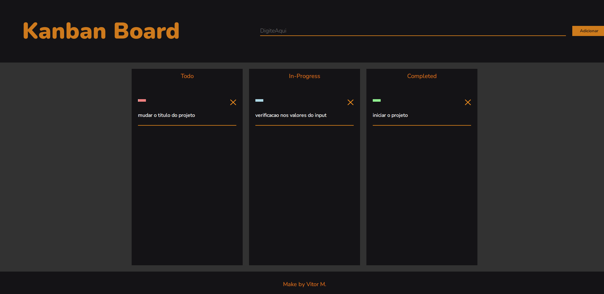

# Kanban Board

Uma aplicação inteiramente funcional de kanban com React Js.

  
## SUMÁRIO

- Status
- Features
- Demonstração da Aplicação
- Como Rodar a Aplicação
- Pré Requisitos Para Rodar a Aplicação
- Tecnologias utilizadas
- Autor

## Status

✨Concluído ✨

## Features

- Input Para adicionar cards ao kanbam
- Site responsivo
- Funcionalidade drag and drop para arrastar os cards entre os quadros
- Armazenamento dos cardas no LocalStorage
- Você pode remover os items do seu storage

## Demonstração da Aplicação

### Clone Netflix Desktop

### Clone Netflix Mobile

## Pré Requisitos Para Rodar a Aplicação

Você precisa simplesmente de um browser de internet (navegador).

## Como Rodar a Aplicação

Para Ver a aplicação, abri o index html no seu navegador de internet.

## Tecnologias Utilizadas

- [html](https://developer.mozilla.org/pt-BR/docs/Web/HTML)
- [css](https://developer.mozilla.org/pt-BR/docs/Web/CSS)
- [javscript](https://developer.mozilla.org/pt-BR/docs/Web/JavaScript)

## Autor

Feito por Vitor Mateus

 
